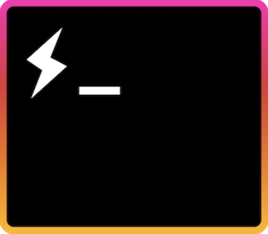

# Hyper.js on Windows

[Hyper.js Official site](https://hyper.is)

> See my configuration to Mac Os [here](../README.md)

> :warning: Required Windows with WSL2 configured with Ubuntu
> My WSL configuration → https://github.com/fabianogoes/wsl-ubuntu

- [Hyper.js on Windows](#hyperjs-on-windows)
  - [Windows Settings](#windows-settings)
  - [Powershell](#powershell)
  - [Wsl Ubuntu](#wsl-ubuntu)
  - [Customize Hyper](#customize-hyper)
  - [References](#references)

## Windows Settings

Ativar modo Desenvolvedor:

- Windows 10 → `Configurações → Para desenvolvedor`
- Windows 11 → `Configurações → Provacidade e segurança → Para desenvolvedor`

## Powershell

Setar Ubuntu como default

* `wsl --list`
* `wsl --setdefault <UBUNTU_NAME>` exemplo: → `wsl --setdefault UBUNTU-22.04`
* `wsl --shutdown`

> Restart Hyper.js

## Wsl Ubuntu

```bash
sudo apt update -y && sudo apt install neofetch
```

→ `/etc/wsl.config`

```bash
[interop]
appendWindowsPath = false
```

→ `~/.bashrc`

```bash
neofetch
bash -c zsh
```

## Customize Hyper

`~/.hyper.js`

→ **shell**

```
shell: 'C:\\Windows\\System32\\bash.exe',
shellArgs: ['~'],
```

→ **Plugins**

[https://github.com/bnb/awesome-hyper](https://github.com/bnb/awesome-hyper)

```jsx
plugins: [
  'hypertheme',
  'hyper-omni-theme',
  'hyper-opacity',
  'hypercwd',
  'hyper-active-tab',
  'hyperborder',
  'hyper-hide-title',
  'hyperterm-paste',
  'hyperline',
  'hyper-font-ligatures',
  'hyper-tabs-enhanced',
  'hyper-pane',
];
```

→ **Font**

[MesloLGS NF Bold Italic.ttf](../fonts/MesloLGS_NF_Bold_Italic.ttf)

[MesloLGS NF Bold.ttf](../fonts/MesloLGS_NF_Bold.ttf)

[MesloLGS NF Italic.ttf](../fonts/MesloLGS_NF_Italic.ttf)

[MesloLGS NF Regular.ttf](../fonts/MesloLGS_NF_Regular.ttf)

```jsx
fontFamily: '"MesloLGS NF"',
```

→ **Opacity**

[GitHub - lucleray/hyper-opacity: Set the opacity of your Hyper terminal (Windows and MacOS)](https://github.com/lucleray/hyper-opacity)

```jsx
module.exports = {
  config: {
    //...
    opacity: 1.0,

    // ...
    keymaps: {
      // Example
      // 'window:devtools': 'cmd+alt+o',
    },
    hyperTabs: {
      border: true,
      tabIconsColored: true,
      activityColor: 'salmon',
    },
    hyperBorder: {
      borderWidth: '8px',
      // animate: true,
      animate: {
        duration: '2000', // default is 18000
      },
    },
    webGLRenderer: false, //This is for enabling ligatures
    activeTab: '🚀',
  },
};
```

## References

→ [WSL2 Redesigned Windows Terminal (Hyper.js + ZSH + Oh My ZSH + Spaceship + More)](https://www.youtube.com/watch?v=B2FV-6pqm68)
